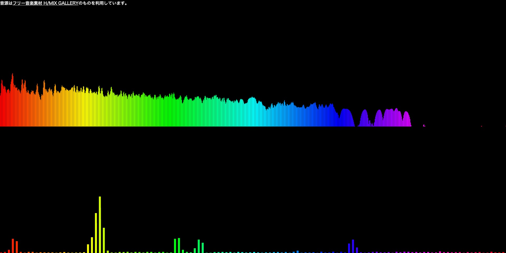

# Web AudioのgetByteFrequencyDataで取得する配列のどの要素がどの周波数(Hz)の波形データを格納しているか確認する


[デモ](https://soarflat-prototype.github.io/web-audio/demo3/index.html)**(ページを開くと音が流れるので音量注意)**

上のビジュアライザーは**0Hz~約20000Hz**、下のビジュアライザーは**0Hz~約2000Hz**の範囲の波形データを描画しているものです。(下のビジュアライザーは少し描画を調整しています。)

このような描画をしたい場合、getByteFrequencyDataで取得する配列のどの要素がどの周波数(Hz)の波形データを格納しているか知る必要があります。

# getByteFrequencyDataで取得する配列のどの要素がどの周波数(Hz)の波形データを格納しているか確認する
デモのようなWeb Audioでオーディオビジュアライザーを制作する際に、以下のように`getByteFrequencyData`で周波数領域の波形データ(スペクトル)を取得すると思います。

```js:
var audioCtx = new AudioContext();
var analyser = audioCtx.createAnalyser();
var bufferLength;
var frequency;
var value;

analyser.fftSize = 2048;                    // デフォルト2048
bufferLength = analyser.frequencyBinCount;  // analyser.fftSizeの半分のため、1024
frequency = new Uint8Array(bufferLength);

analyser.getByteFrequencyData(frequency);

for(var i = 0; i < bufferLength; i++) {
  value = frequency[i]; // 波形データ 0 ~ 255が格納されている。
}
```

今回`analyser.fftSize`はデフォルトの2048のため、`frequency`配列には周波数毎の要素が1024個格納されています。

どの要素がどの周波数(Hz)の波形データを格納しているかは、以下の計算で確認することができます。

**配列のインデックス * AudioContextのサンプルレート(44100固定) / AnalyserNodeのfftSize**

この計算で、上記の例の`frequency[i]`にどの周波数(Hz)の波形データが格納されているかわかります。

`AnalyserNode`の`fftSize`は2048であり、`frequency`配列の要素は1024個のため、0Hz~22028Hzの波形データが格納されています。

```js:
for(var i = 0; i < bufferLength; i++) {
  value = frequency[i]; // (i * 44100 / 2048)Hzの波形データ 0 ~ 255が格納されている。
}

// 0 * 44100 / 2048 = 0.0 Hz
// 1 * 44100 / 2048 = 21.53 Hz
// 2 * 44100 / 2048 = 43.06 Hz
// 3 * 44100 / 2048 = 64.59 Hz
// ...
// ...
// 1023 * 44100 / 2048 = 22028 Hz
```

今回の例では22028Hzまでの波形データが取得できますが、人間の可聴音域は20000Hzと言われており、実際の音楽でも20000Hz付近の波形データが0のことが多いため、この範囲まで取得する必要は必ずしもないと思います。(高い周波数が出る曲もあるため、高い周波数の範囲だけ取得してうまく描画に利用するのも良いと思います。)

0Hz~2000Hzのように範囲を狭めた波形データを取得し、それらを細かく調整して描画した方が動きに抑揚があってビジュアライザーっぽくなると思いました。

# 参考
- [What does the FFT data in the Web Audio API correspond to?](http://stackoverflow.com/questions/14789283/what-does-the-fft-data-in-the-web-audio-api-correspond-to)
